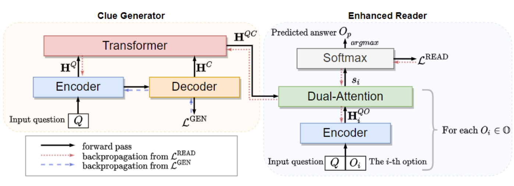

# GenMC

Code for [Clues Before Answers: Generation-Enhanced Multiple-Choice QA ](https://arxiv.org/pdf/2205.00274.pdf) (NAACL 2022)


We propose a generation-enhanced multiple-choice QA model named GenMC. It generates a clue from the question and then leverages the clue to enhance a reader for multiple-choice QA.

## Installation
```angular2html
pip install -r requirements.txt
```


### How to Run

```angular2html
python run_genmc.py  \
  --model_path $DATA_PATH$ \
  --choice_num $Choice_Num$ \
  --data_path_train $TRAIN_FILE$ \
  --data_path_dev $DEV_FILE$ \
  --data_path_test $TEST_FILE$ 
```

Example:
```
python run_genmc.py --model_path t5-base --choice_num 5 --data_path_train ./data/csqa/in_hourse/train.jsonl  --data_path_dev ./data/csqa/in_hourse/dev.jsonl  --data_path_test ./data/csqa/in_hourse/test.jsonl 
```

### Reference

Please cite this paper in your publications if it helps your research:

```
@inproceedings{DBLP:conf/naacl/HuangWZGZ022,
  author    = {Zixian Huang and
               Ao Wu and
               Jiaying Zhou and
               Yu Gu and
               Yue Zhao and
               Gong Cheng},
  editor    = {Marine Carpuat and
               Marie{-}Catherine de Marneffe and
               Iv{\'{a}}n Vladimir Meza Ru{\'{\i}}z},
  title     = {Clues Before Answers: Generation-Enhanced Multiple-Choice {QA}},
  booktitle = {Proceedings of the 2022 Conference of the North American Chapter of
               the Association for Computational Linguistics: Human Language Technologies,
               {NAACL} 2022, Seattle, WA, United States, July 10-15, 2022},
  pages     = {3272--3287},
  publisher = {Association for Computational Linguistics},
  year      = {2022},
  url       = {https://aclanthology.org/2022.naacl-main.239},
  timestamp = {Fri, 15 Jul 2022 14:51:04 +0200},
  biburl    = {https://dblp.org/rec/conf/naacl/HuangWZGZ022.bib},
  bibsource = {dblp computer science bibliography, https://dblp.org}
}
```
