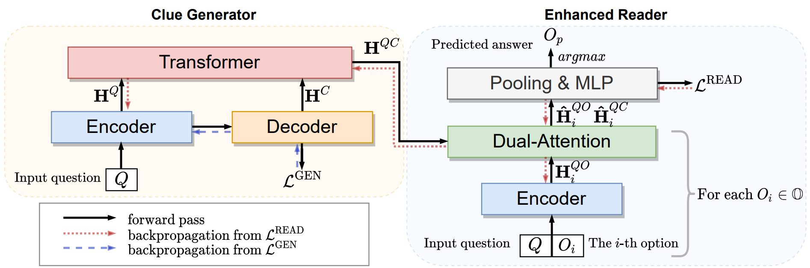

# GenMC

Code for [Clues Before Answers: Generation-Enhanced Multiple-Choice QA ](https://arxiv.org/) (NAACL 2022)


## Installation
```angular2html
pip install -r requirements.txt
```


### How to Run

```angular2html
python run_genmc.py  \
  --model_path $DATA_PATH$ \
  --choice_num $Choice_Num$ \
  --data_path_train $TRAIN_FILE$ \
  --data_path_dev $DEV_FILE$ \
  --data_path_test $TEST_FILE$ 
```

Example:
```
python run_genmc.py --model_path t5-base --choice_num 5 --data_path_train ./data/csqa/in_hourse/train.jsonl  --data_path_dev ./data/csqa/in_hourse/dev.jsonl  --data_path_test ./data/csqa/in_hourse/test.jsonl 
```

### Reference

Please cite this paper in your publications if it helps your research:

